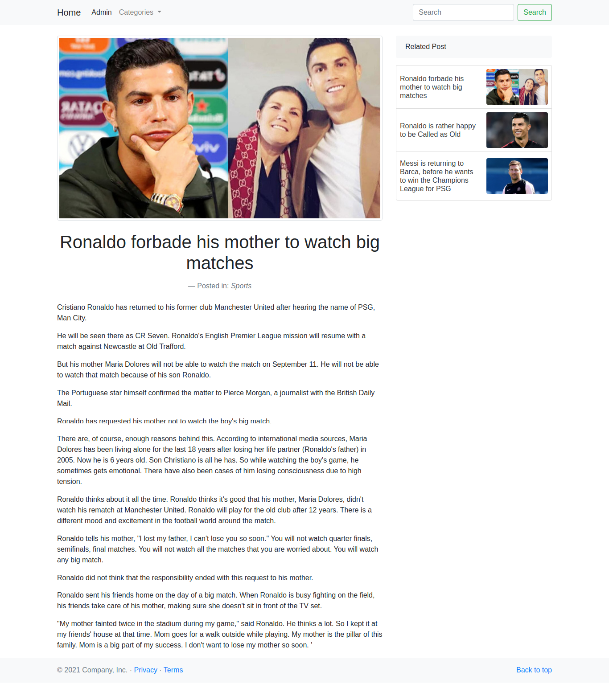
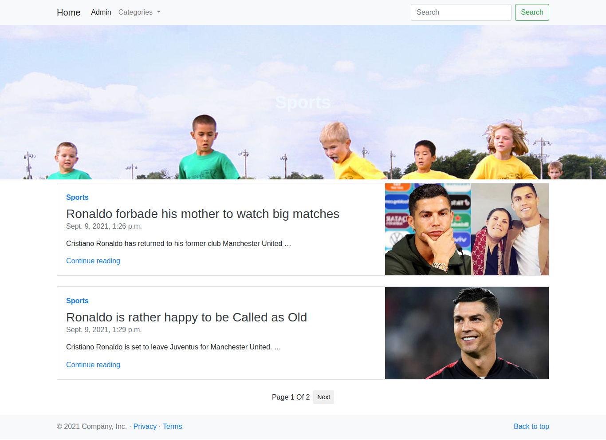

Demo Link: http://simple-djblog.herokuapp.com

Simple Django Blog With Advanced Pagination, Searchbar, Bootstrap for responsive.

<dv align="center" style="display: grid;
    grid-template-columns: 1fr 1fr; grid-gap:15px;">
  
  
  
  
</dv>